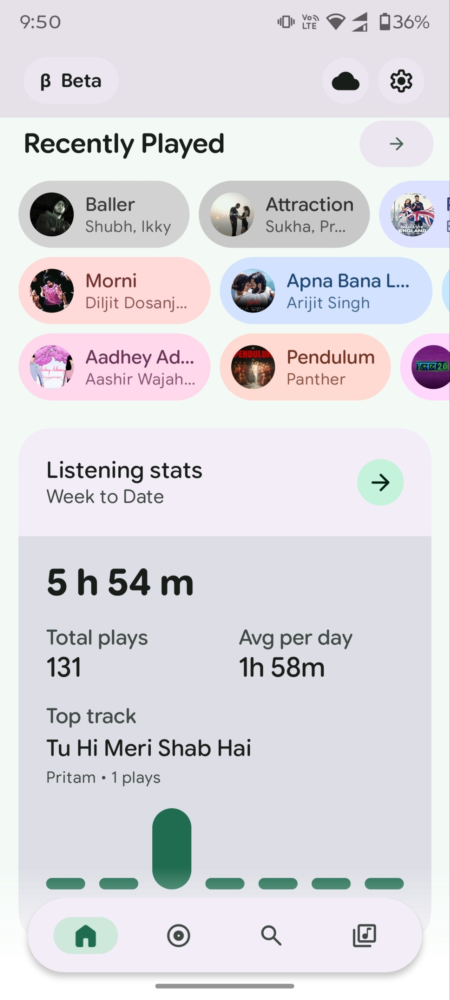

# Pixel Music🎶

<p align="center">
  
</p>

<p align="center">
  <strong>The Ultimate Hybrid Local, Streaming, and Cloud Music Powerhouse for Android</strong><br>
  An elegant, feature-rich audio experience built for audiophiles, cloud hoarders, and streaming enthusiasts alike.
</p>

<p align="center">
  
  
  
  
</p>

<p align="center">
  <a href="https://android.com"></a>
  <a href="https://kotlinlang.org"></a>
  <a href="LICENSE"></a>
  <a href="https://t.me/PixelMusicApp"></a>
</p>

> Gratitude to the original open-source authors and contributors whose foundational work made this project possible.

---

## 📖 What is Pixel Music?

**Pixel Music** is a unified, privacy-first audio powerhouse for Android. It bridges your local offline library, streaming catalogs, and cloud sources under a single, gorgeous interface.

- **Local Library:** Scan and play high-resolution files like FLAC, ALAC, WAV, APE, OPUS, OGG, and MP3.
- **YouTube Music Streaming:** Stream the entire catalog without advertisements. Sign in securely to sync liked tracks, playlists, and subscribed artists.
- **Telegram Integration:** Connect your Telegram account to stream audio directly from channels, chats, and saved messages.
- **Google Drive:** Stream your personal cloud library (work in progress).

The interface adapts dynamically to your album artwork colors using Material You, and is packed with advanced playback features, lyrics, and cross-device connectivity.

---

## ⚡ Feature Highlights

| Feature | Description |
|:---|:---|
| **Premium Audio Engine** | Media3 ExoPlayer with FFmpeg decoding, 10-band equalizer, bass boost, spatial virtualizer, and EBU R128 loudness normalization. |
| **Hybrid Streaming** | YouTube Music, Telegram channels, and local files in one unified library. |
| **Real-Time Lyrics** | Synchronized LRC lyrics with manual offset tuning, offline caching, and translation support. |
| **Generative AI Playlists** | Describe a mood or style and let the built-in AI assistant curate the perfect queue. |
| **Smart Mixes** | Last.fm-powered discovery with 8 generation modes and auto-cleanup policies. |
| **Dynamic Material You** | Interface colors adapt smoothly to album artwork using HSL extraction. |
| **Connectivity** | Android Auto, Chromecast, Wear OS companion, and Quick Settings tiles. |
| **Sharing** | Spotify-style share cards with glassmorphism and Snapchat story integration. |
| **Widgets** | Material 3 home-screen widgets with playback controls and artwork. |

---

## 🚀 Installation

This repository contains **official APK releases** for sideloading. No source code is published here.

### Prerequisites
- Android 11 (API 30) or higher
- ~150 MB free storage

### Steps
1. Download the latest APK for your device architecture from the [Releases](../../releases) page:
   - **`arm64-v8a`** — most modern phones (recommended)
   - **`armeabi-v7a`** — older 32-bit devices
   - **`x86_64`** — emulators and some tablets
2. Transfer the APK to your Android device.
3. Open the APK file and tap **Install**.
4. If prompted, allow installation from your browser or file manager in Settings.

> **Tip:** If you are unsure which APK to pick, choose **`arm64-v8a`**. It works on the vast majority of devices released after 2015.

---

## 📋 Requirements & Permissions

- **Minimum OS:** Android 11 (API 30)
- **Target OS:** Android 15+ (API 37)
- **Permissions:** Internet, Bluetooth, media read access, notifications, and foreground service (for background playback).

---

## ⚖️ Disclaimer & Legal Notice

Pixel Music is an independent, third-party audio player and client. It is **not** associated with Google LLC, YouTube Music, Deezer, Telegram, or any of their parent companies.

- **No Media Hosting:** This app does not host, upload, or store copyrighted music. It operates strictly as an interface to scan local device storage or stream media directly from public or user-authenticated APIs.
- **Fair Use:** This software is created for personal research, educational, and fair-use purposes. Users are responsible for ensuring compliance with local copyright laws and platform Terms of Service.
- **Non-Commercial:** Selling, distributing, or publishing this application on commercial marketplaces is strictly prohibited.

---

## 📄 License

This project is licensed under a **Proprietary License** for personal, non-commercial use only.

```text
Copyright (c) 2026 Pixel Music Contributors

Permission is hereby granted, free of charge, to any person obtaining a copy of this software
and associated documentation files (the "Software"), to study, review, and use the Software
for personal, non-commercial purposes only, subject to the following conditions:

The above copyright notice and this permission notice shall be included in all copies or
substantial portions of the Software.

Commercial use, including but not limited to the sale, redistribution, or publishing of the
Software (or any derivative work) on the Google Play Store or any other commercial platform,
is strictly prohibited.
```

For the full license text, see the [LICENSE](LICENSE) file.

---

<p align="center">
  <a href="https://t.me/PixelMusicApp">Telegram Channel</a> •
  <a href="../../releases">Releases</a> •
  <a href="CHANGELOG.md">Changelog</a>
</p>
