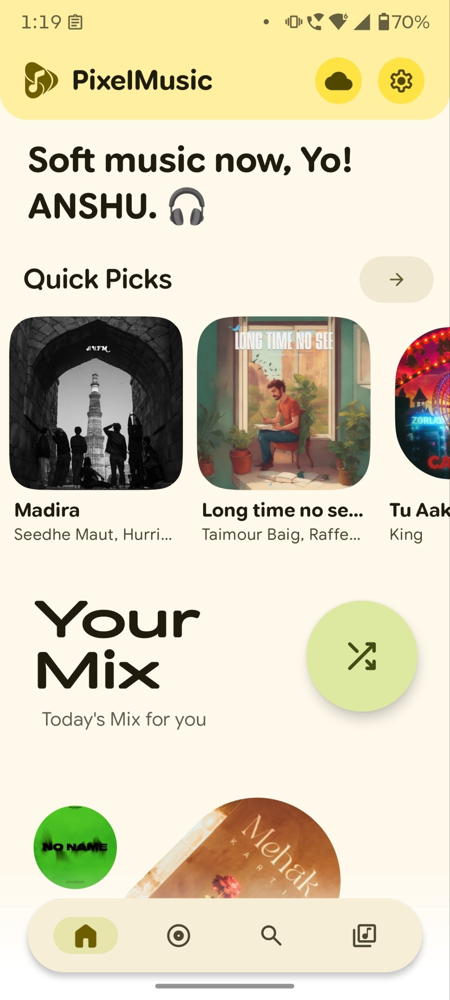
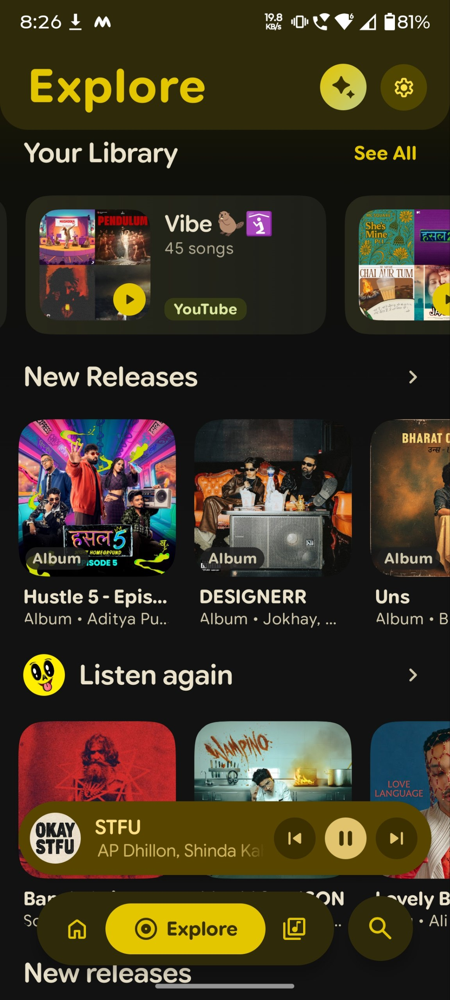
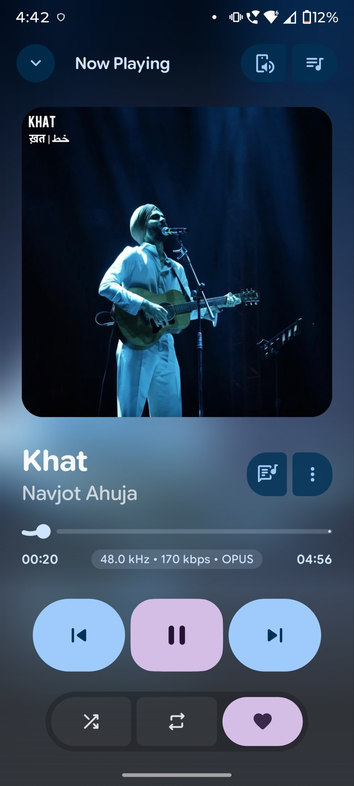
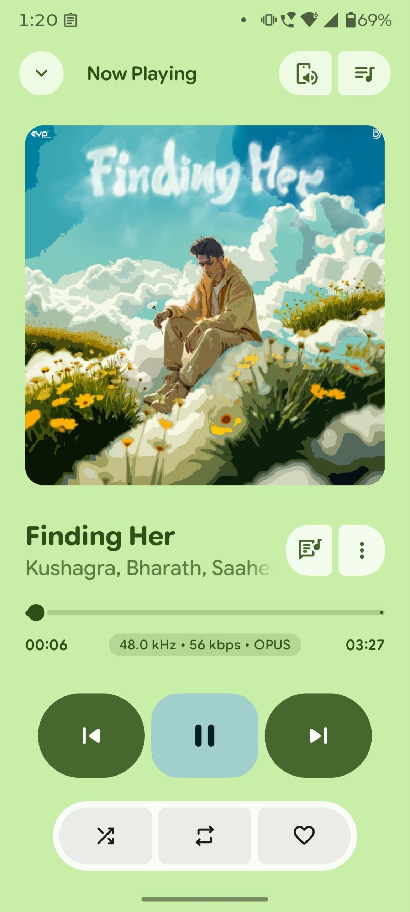
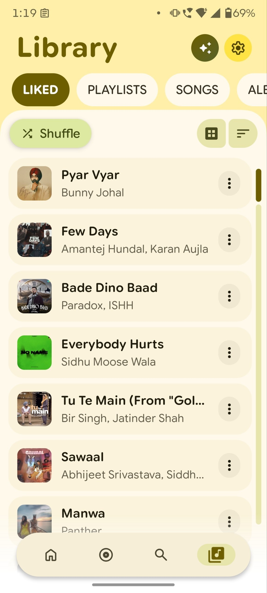
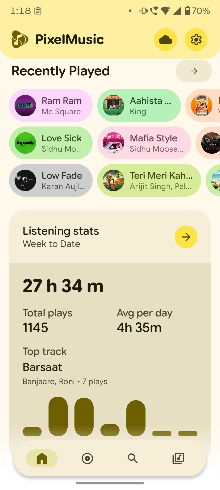
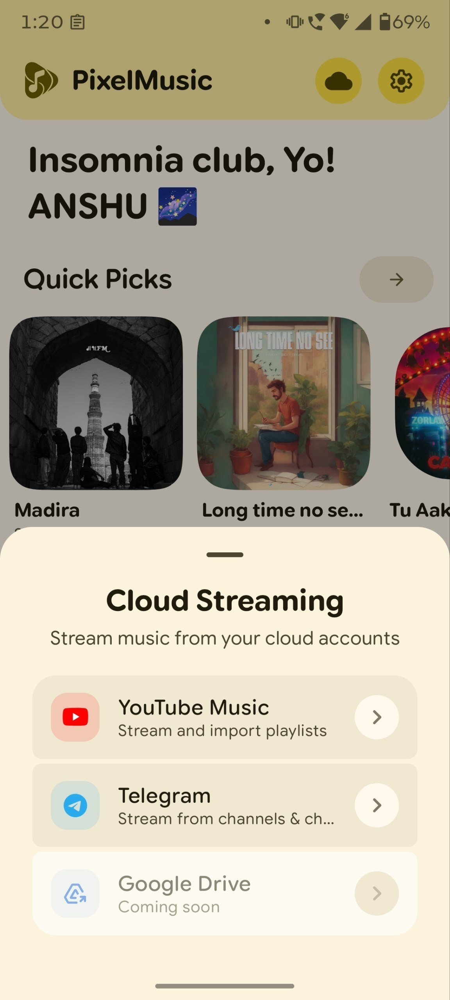

# Pixel Music 🎶 [](https://ko-fi.com/H2K222J1ME)

<p align="center">
  
</p>

<p align="center">
  <strong>The Ultimate Hybrid Local, Streaming, and Cloud Music Powerhouse for Android</strong><br> 
  An elegant, feature-rich audio experience built for audiophiles, cloud hoarders, and streaming enthusiasts alike.
</p>

<p align="center">
  
  
  
  
  
  
  
  
</p>

<p align="center">
  <a href="https://ko-fi.com/H2K222J1ME" target="_blank">
    
  </a>
</p>

<p align="center">
  <a href="https://android.com"></a>
  <a href="https://kotlinlang.org"></a>
  <a href="LICENSE"></a>
  <a href="https://t.me/PixelMusicApp"></a>
</p>

> Gratitude to the original open-source authors and contributors whose foundational work made this project possible.

---

## 📖 What is Pixel Music?

**Pixel Music** is a unified, privacy-first audio powerhouse for Android. It bridges your local offline library, streaming catalogs, and cloud sources under a single, gorgeous interface.

- **Local Library:** Scan and play high-resolution files like FLAC, ALAC, WAV, APE, OPUS, OGG, and MP3.
- **YouTube Music Streaming:** Stream the entire catalog without advertisements. Sign in securely to sync liked tracks, playlists, and subscribed artists.
- **Telegram Integration:** Connect your Telegram account to stream audio directly from channels, chats, and saved messages.
- **Google Drive:** Stream your personal cloud library directly from remote drives.
- **Deezer Artist Artwork:** High-definition artist covers and backdrop artwork automatically cataloged.

The interface adapts dynamically to your album artwork colors using Material You, and is packed with advanced playback features, lyrics, and cross-device connectivity.

---

## ⚡ Feature Highlights

| Feature | Description |
|:---|:---|
| **Premium Audio Engine** | Media3 ExoPlayer with FFmpeg decoding, 10-band hardware equalizer, bass boost, spatial virtualizer, and EBU R128 loudness normalization. |
| **Hybrid Streaming** | YouTube Music, Telegram channels, Google Drive, and local files in one unified library. |
| **Real-Time Synchronized Lyrics** | Synchronized LRC lyrics with manual millisecond offset tuning, offline caching, and live translation support. |
| **Generative AI Playlists** | Feed custom mood/prompt descriptions to AI models (Gemini, DeepSeek, OpenAI) to generate intelligent queues. |
| **Smart Mixes (Last.fm)** | Last.fm-powered discovery with 8 generation modes and automated retention pruning policies. |
| **Dynamic Material You** | Adaptive HSL color extraction from album artwork for player sheets, sliders, and navigation surfaces. |
| **Snapchat & Story Sharing** | Spotify-style shareable cards with glassmorphism, dynamic pastels, and Snapchat Creative Kit integration. |
| **Connectivity & Ecosystem** | Android Auto, Chromecast, Wear OS companion app, and Quick Settings playback tiles. |
| **Interactive Widgets** | Material 3 Glance home-screen widgets with playback controls and artwork displays. |

---

## 🚀 Installation & Downloads

This repository contains **official APK releases** for sideloading.

### Prerequisites
- Android 11 (API 30) or higher
- ~150 MB free storage

### Steps
1. Download the latest APK for your device architecture from the [Releases](../../releases) page:
   - **`arm64-v8a`** — most modern phones (recommended)
   - **`armeabi-v7a`** — older 32-bit devices
   - **`x86_64`** — emulators and Chromebooks / tablets
   - **`universal`** — compatible with all supported devices
2. Open the downloaded APK file on your device and tap **Install**.
3. If prompted, allow installation from your browser or file manager in Settings.

> **Tip:** If you are unsure which APK to pick, choose **`arm64-v8a`**. It works on the vast majority of modern Android devices.

---

## 📋 Requirements & Permissions

- **Minimum OS:** Android 11 (API 30)
- **Target OS:** Android 15+ (API 37)
- **Permissions:** Internet, Bluetooth, media storage read access, notifications, and foreground service (for background playback).

---

## 📚 Documentation & Project Links

- 🔒 **[Security Policy](SECURITY.md)** — Release verification, APK checksums, and reporting vulnerabilities.
- 🛡️ **[Privacy Policy](PRIVACY_POLICY.md)** — Privacy commitments and on-device data handling.
- ⚖️ **[Disclaimer & Legal Notice](DISCLAIMER.md)** — Third-party service disclaimers and fair-use terms.
- 📜 **[Provenance & Attribution](PROVENANCE.md)** — Historical context and upstream acknowledgments.
- 📦 **[Third-Party Notices](THIRD_PARTY_NOTICES.md)** — Open-source software licenses and dependencies.
- 🤝 **[Contributing Guidelines](CONTRIBUTING.md)** — Bug reporting and feedback guide.
- 📝 **[Changelog](CHANGELOG.md)** — Comprehensive version history and updates.

---

## ⚖️ Disclaimer & Legal Notice

Pixel Music is an independent, third-party audio player and client. It is **not** associated with Google LLC, YouTube Music, Deezer, Telegram, Snapchat, Last.fm, ListenBrainz, or any of their parent companies.

- **No Media Hosting:** This app does not host, upload, or store copyrighted music. It operates strictly as an interface to scan local device storage or stream media directly from public or user-authenticated APIs.
- **Fair Use:** This software is created for personal research, educational, and fair-use purposes. Users are responsible for ensuring compliance with local copyright laws and platform Terms of Service.
- **Non-Commercial:** Selling, distributing, or publishing this application on commercial marketplaces is strictly prohibited.

For complete terms, read [DISCLAIMER.md](DISCLAIMER.md).

---

## 📄 License

This project is licensed under a **Proprietary License** for personal, non-commercial use only.

```text
Copyright (c) 2026 Pixel Music Contributors

Permission is hereby granted, free of charge, to any person obtaining a copy of this software
and associated documentation files (the "Software"), to study, review, and use the Software
for personal, non-commercial purposes only, subject to the following conditions:

The above copyright notice and this permission notice shall be included in all copies or
substantial portions of the Software.

Commercial use, including but not limited to the sale, redistribution, or publishing of the
Software (or any derivative work) on the Google Play Store or any other commercial platform,
is strictly prohibited.
```

For the full license text, see [LICENSE](LICENSE).

---

<p align="center">
  <a href="https://ko-fi.com/H2K222J1ME" target="_blank">
    
  </a>
</p>

<p align="center">
  <a href="https://t.me/PixelMusicApp">Telegram Channel</a> •
  <a href="../../releases">Releases</a> •
  <a href="CHANGELOG.md">Changelog</a> •
  <a href="PRIVACY_POLICY.md">Privacy Policy</a> •
  <a href="SECURITY.md">Security</a>
</p>
