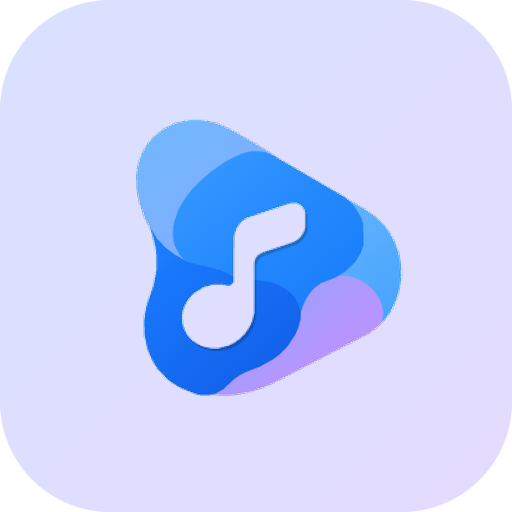
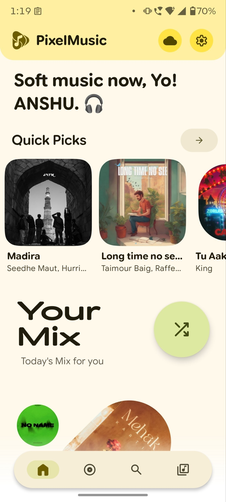
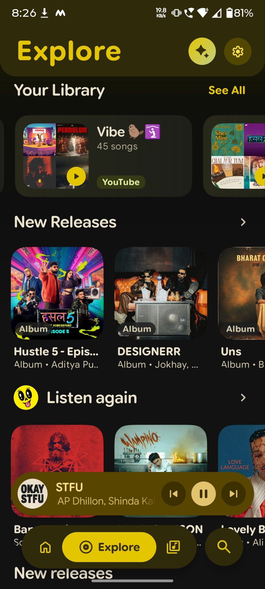
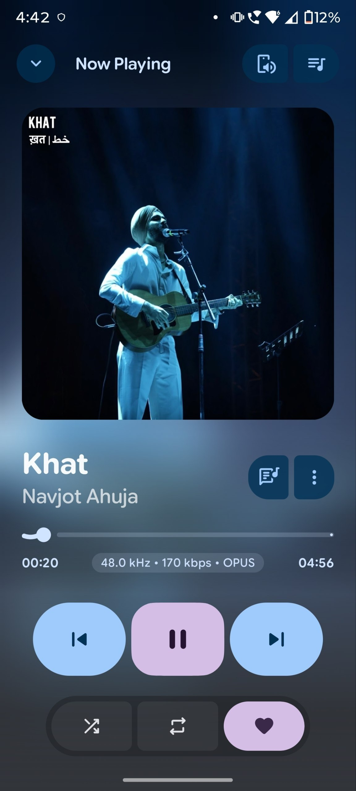
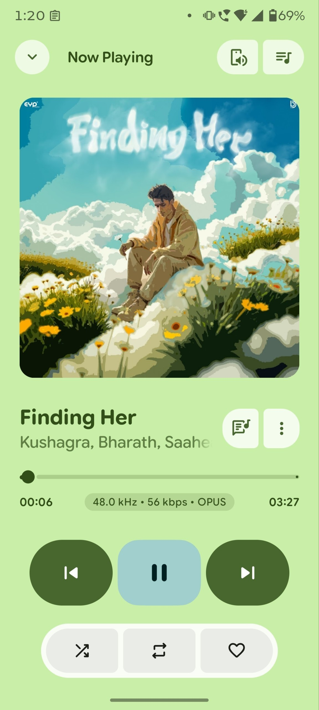
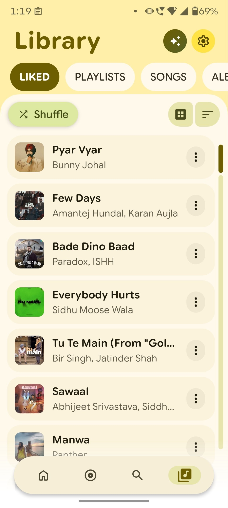
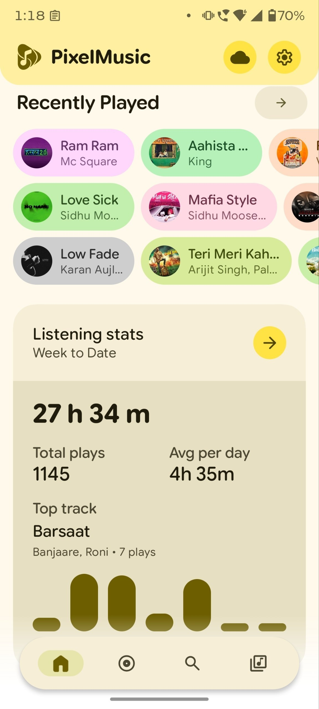
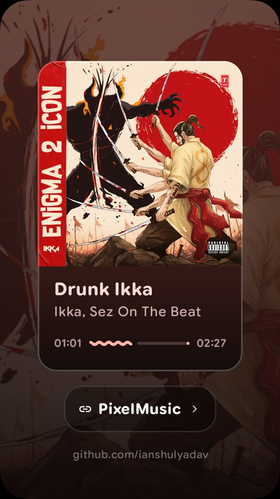
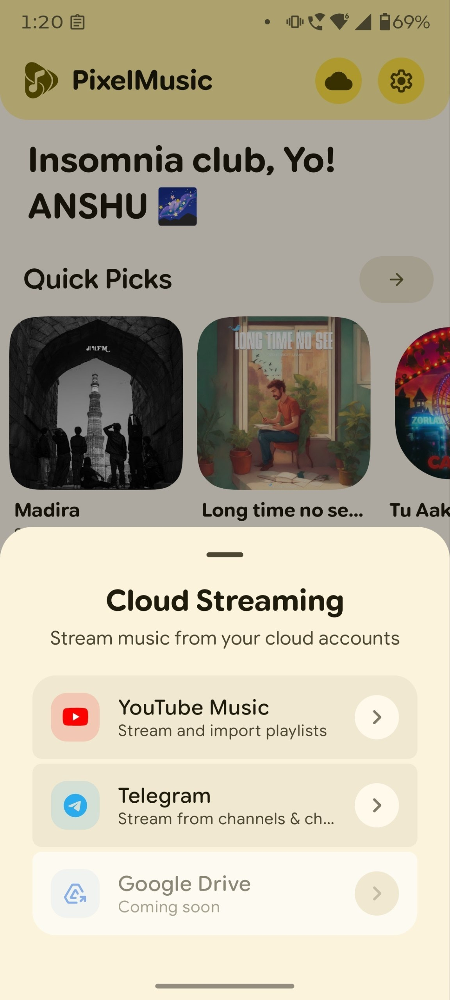

# PixelMusic Official APK Download [](https://ko-fi.com/H2K222J1ME)

<p align="center">
  
</p>

<p align="center">
  <strong>PixelMusic is an Android music player</strong> built with Material 3 Expressive and dynamic Material You theming.<br>
  It plays your offline local audio files and supports streaming from YouTube Music, Telegram audio channels, and Google Drive in a clean, privacy-focused interface.
</p>

<p align="center">
  
  
  
  
  
  
</p>
<p align="center"><em>pick your app icon according to your choise</em></p>

<p align="center">
  
  
  
  
  
  
  
  
</p>

<p align="center">
  <a href="https://github.com/ianshulyadav/PixelMusicApp/releases/latest">
    
  </a>
  <a href="https://t.me/PixelMusicApp">
    
  </a>
  <a href="https://ko-fi.com/H2K222J1ME" target="_blank">
    
  </a>
</p>

<p align="center">
  <a href="https://android.com"></a>
  <a href="https://kotlinlang.org"></a>
  <a href="LICENSE"></a>
  <a href="CHANGELOG.md"></a>
</p>

---

## 📥 Direct APK Downloads

Official signed APK builds from the [Releases](https://github.com/ianshulyadav/PixelMusicApp/releases) page and the [Telegram Channel](https://t.me/PixelMusicApp):

| Package | Target | Link |
|:---|:---|:---:|
| **`app-arm64-v8a-release.apk`** | **Recommended:** Most Android phones | [Download](https://github.com/ianshulyadav/PixelMusicApp/releases/latest/download/app-arm64-v8a-release.apk) |
| **`app-universal-release.apk`** | Universal build for all devices | [Download](https://github.com/ianshulyadav/PixelMusicApp/releases/latest/download/app-universal-release.apk) |
| **`app-armeabi-v7a-release.apk`** | Older 32-bit phones | [Download](https://github.com/ianshulyadav/PixelMusicApp/releases/latest/download/app-armeabi-v7a-release.apk) |
| **`app-x86_64-release.apk`** | Emulators and ChromeOS tablets | [Download](https://github.com/ianshulyadav/PixelMusicApp/releases/latest/download/app-x86_64-release.apk) |

### Installation
1. Download the `arm64-v8a` APK (or `universal` if unsure).
2. Tap the file in your browser or file manager to install.
3. If requested by Android, enable **Allow from this source** in Settings.
4. Open PixelMusic and grant storage permission to load your local music.

---

## 🌟 Core Features

- **Local Audio Playback:** Native playback for FLAC, ALAC (Apple Lossless), WAV, OPUS, OGG, APE, MP3, and .caf with gapless playback.
- **YouTube Music Streaming:** Browse, search, and play songs, albums, and playlists from YouTube Music without ads.
- **Telegram Audio:** Connect your Telegram account to play audio files directly from your channels, chats, and saved messages.
- **Google Drive Playback:** Stream audio files directly from your Google Drive without downloading them to your phone first.
- **Hi-Fi Lossless Streaming:** High-resolution playback and downloads with audio format tags *(bring your own API / account)*.
- **Playlist Importer:** Paste public Spotify and YouTube playlist links to import them directly into your library.
- **Real-Time Synced Lyrics:** Synchronized LRC lyrics with millisecond offset adjustments, offline caching, and translation.
- **Material 3 Expressive UI:** Fluid animations, floating bottom navigation, home screen collage, and dynamic themes derived from album art.

---

## ⚡ Feature Matrix

| Feature | Details |
|:---|:---|
| **Audio Engine** | ExoPlayer Media3 with FFmpeg decoders, 10-band equalizer, bass boost, and EBU R128 loudness normalization. |
| **Unified Library** | Combines local storage, YouTube Music, Telegram channels, and Google Drive into one searchable library. |
| **Lossless Streaming** | High-fidelity audio streaming and caching *(BYO API / account)*. |
| **Lyrics** | Synchronized LRC lyrics with time offset calibration and translation support. |
| **Playlist Import** | One-tap import for Spotify and YouTube playlist links. |
| **Material 3 UI** | Expressive wavy sliders, pill navigation, and 10 dynamic color themes. |
| **Explore & Discovery** | Daily discover carousel, mood tags (Chill, Focus, Workout, Party), and personalized new releases. |
| **Social Sharing** | Song cards and lyric stories for Snapchat and social media sharing. |
| **Ecosystem** | Android Auto support, Wear OS companion, and Glance home screen widgets. |
| **Languages** | Full localization in 11 languages (English, German, Spanish, French, Indonesian, Italian, Korean, Norwegian, Portuguese, Russian, Simplified Chinese). |

---

## 🎨 Themes & Customization

- **Dynamic Material You:** Automatically extracts colors from current album art for player controls, sliders, and background sheets.
- **Color Presets:** Blue Purple, Baby Pink Purple, Graphite Gray, Pure Monochrome, Dark & Grey, Lime Green, and Dynamic Pastel.
- **Store Icons:** 6 matching launcher icons with 512×512 store variants.

---

## 📋 System Requirements & Permissions

- **Minimum Version:** Android 11 (API 30)
- **Target Version:** Android 15+ (API 37)
- **Architectures:** `arm64-v8a`, `armeabi-v7a`, `x86_64`, `universal`
- **Permissions:**
  - `READ_MEDIA_AUDIO` / `READ_EXTERNAL_STORAGE` (local audio files)
  - `INTERNET` (streaming, album artwork, lyrics)
  - `FOREGROUND_SERVICE` & `FOREGROUND_SERVICE_MEDIA_PLAYBACK` (background playback)
  - `POST_NOTIFICATIONS` (playback notification controls)

---

## 📚 Documentation & Project Links

- 🔒 **[Security Policy](SECURITY.md)** — Release verification and vulnerability reporting.
- 🛡️ **[Privacy Policy](PRIVACY_POLICY.md)** — Privacy details and on-device data handling.
- ⚖️ **[Disclaimer & Legal Notice](DISCLAIMER.md)** — Third-party service terms and fair use policy.
- 📜 **[Provenance & Lineage](PROVENANCE.md)** — Attribution and project history.
- 📦 **[Third-Party Notices](THIRD_PARTY_NOTICES.md)** — Open source libraries and dependencies.
- 🤝 **[Contributing Guidelines](CONTRIBUTING.md)** — Bug reporting and contribution guide.
- 📝 **[Changelog](CHANGELOG.md)** — Full version history and release notes.

---

## ⚖️ Disclaimer & Fair Use Notice

PixelMusic is an independent open-source media player and is not affiliated with Google, YouTube, Deezer, Telegram, Spotify, Snapchat, Last.fm, or ListenBrainz.

- **No Media Hosting:** PixelMusic does not host or store copyrighted audio on external servers. It acts as an audio player for local storage and an interface for public and user-authenticated APIs.
- **User Responsibility:** Users are responsible for their own use and compliance with the terms of service of any third-party platforms they access.

For full legal details, see [DISCLAIMER.md](DISCLAIMER.md).

---

## 📦 License & Open Source Attribution

PixelMusic is free software released under the **GNU General Public License v3.0** (`GPL-3.0-or-later`).

Portions of this project are based on the open-source [PixelPlayerOSS](https://github.com/PixelPlayerHQ/PixelPlayerOSS) project. Upstream notices and credits are preserved in [THIRD_PARTY_NOTICES.md](THIRD_PARTY_NOTICES.md) and [PROVENANCE.md](PROVENANCE.md).

> Gratitude to the foundational open-source authors and community contributors whose work inspired and empowered this project.

```text
PixelMusic
Copyright (C) 2026 PixelMusic Contributors

This program is free software: you can redistribute it and/or modify
it under the terms of the GNU General Public License as published by
the Free Software Foundation, either version 3 of the License, or
(at your option) any later version.
```
